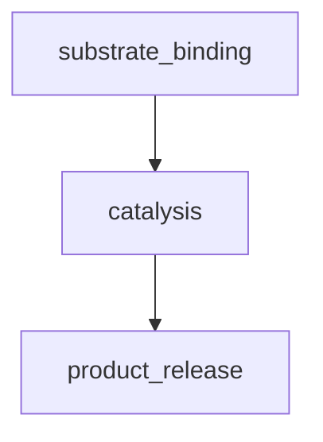

# Industrial Biology
### Overview and Introduction

* The University of Manchester (_Manchester Institute of Biotechnology_)

**Industrial biotechnology** is the production and processing technology of industrial products by using biochemical reactions, and it is a high-level natural process for human beings to simulate biological systems to realize their own development needs.

## Enzymes - Biocatalysts
* **Enzymes** are _protein catalysts_ that _speed up_ the rate of _chemical reactions_ in _living organisms_.

They are encoded by the DNA that determines the sequence of amino acids, folded into a precise secondary and **tertiary structure**.

They may contain other molecules, referred to as **coenzymes** such as FMN, small **organic** groups (that are also involved in the reaction Chemistry catalyzed by enzyme molecules) or prosthetic groups such as _metal ions_.

* Enzymes can be categorized into different **reaction classes** depending on the precise Chemistry that they *catalyze*.
* They include: *Oxidoreductases, Transferases, Hydrolases, Lyases, Isomerases*.

## How are Enzymes made
* **Biosynthesis** i.e. produced naturally by *living organisms* by **transcription** and **translation**.
**Transcription** - refers to the production of an **RNA** copy of the **DNA code** for a specific protein by *RNA polymerase*.

**Translation** - refers to the process whereby a **ribosome** reads the **transcript** and links together the *amino acids* in the correct sequence for each specific protein.

### Summary
> Proteins are made by other proteins, following a DNA/RNA code.
> The genetic code is universal.
> A gene from one organism can be transcribed/translated into another.

## Nature's Catalysts
*"No enzymes, no life"* most biochemical reactions would NOT occur under the mild conditions within cells.

* Rate enhancements catalyzed by enzymes are typically 1015-1023.

**NOTE**: In the absence of an enzyme, some reactions would take longer than the age of the universe.

* Some enzymes require **cofactors** or **coenzymes** (e.g. *heme, flavin*) or prosthetic groups (e.g. metal ions).

## Flexible 'lock' and 'key'
**Enzyme catalytic** cycles are *multistep* catalytic cycles i.e they involve the *binding* of reactants in the **enzyme active site** (*The region of an enzyme where substrate molecules bind and undergo a chemical reaction*).

Substrates or reactants are **assembled** within the active site where the **chemical catalysis** can take place.

The 2nd step of the catalytic cycle is the process of **bond making** and **bond breaking**, which is the catalytic part of the **reaction cycle**.

Products are then **released** from the *active site* at the end of the catalytic cycle to enable another round of catalysis to proceed following **substrate binding**.

*Chart Overview*

* Many of these processes are facilitated by the natural flexibility, confirmational flexibility of enzyme molecules.

**Confirmational Flexibility** is often required to optimally position substrates in the enzyme 
active site and also to provide an optimal environment for catalysis *e.g. through the exclusion of water from the active site*.

**NOTE** There are various models of enzyme catalysis that have been advanced over the years, that include this flexible behavior of enzyme molecules such as:

* The induced-fit model of catalysis, where the exposure of an enzyme to a substrate, causes the active site of an enzyme to change shape in order to allow the enzyme substrate to bond, forming an **enzyme substrate complex**.

## Green Chemistry "benign by design"
Enzymes are ideal catalysts for the production of fine chemicals and pharmaceuticals due to their relatively *mild reaction conditions*, *high catalytic rate* and *specificity*.

This maps nicely to the green chemistry agenda since industrial biotechnology can reduce *e.g. Toxic waste products etc.*

**Biotechnology** is NOT new. It's been used extensively for:

 **Classical Methods**
- Fermentation.
- Purified enzymes.
- Chemically treated enzymes.

**Molecular Biology Era**
- Cloned genes.
- Genetic engineering.
- Protein engineering.
- X-ray structures.

**Genomics/post genomics era**
- Metabolic engineering.
- Synthetic biology.
- Artificial organisms.
